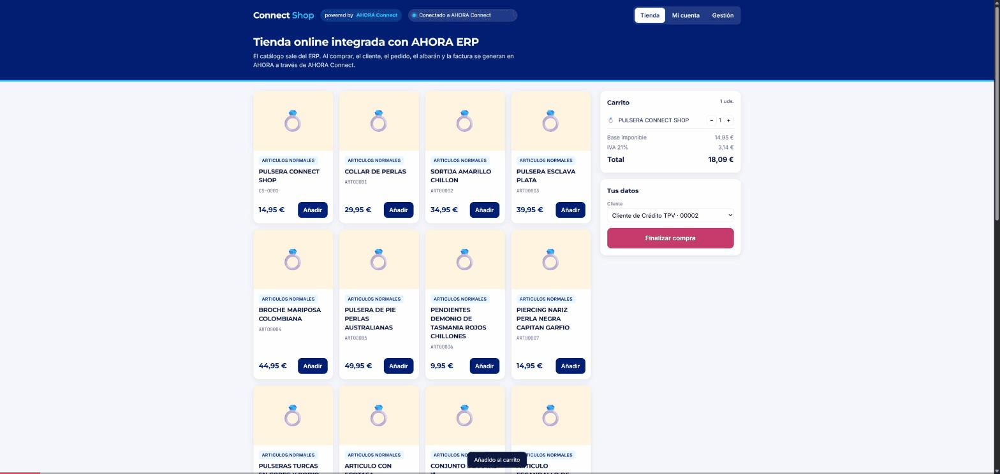
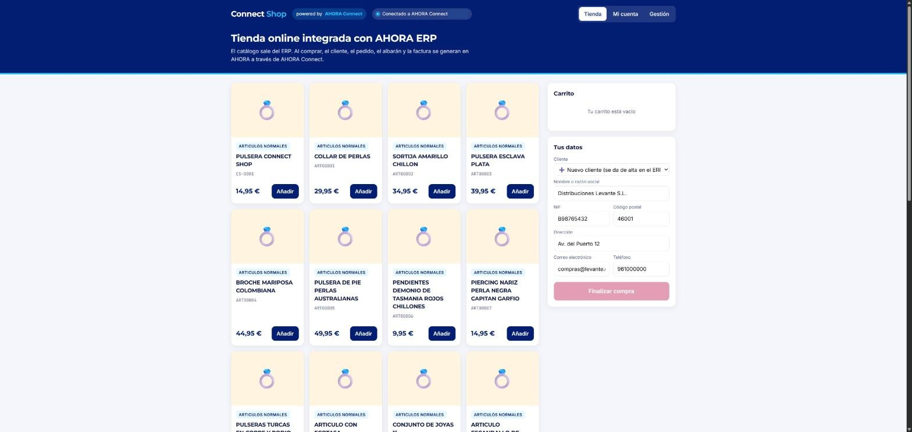
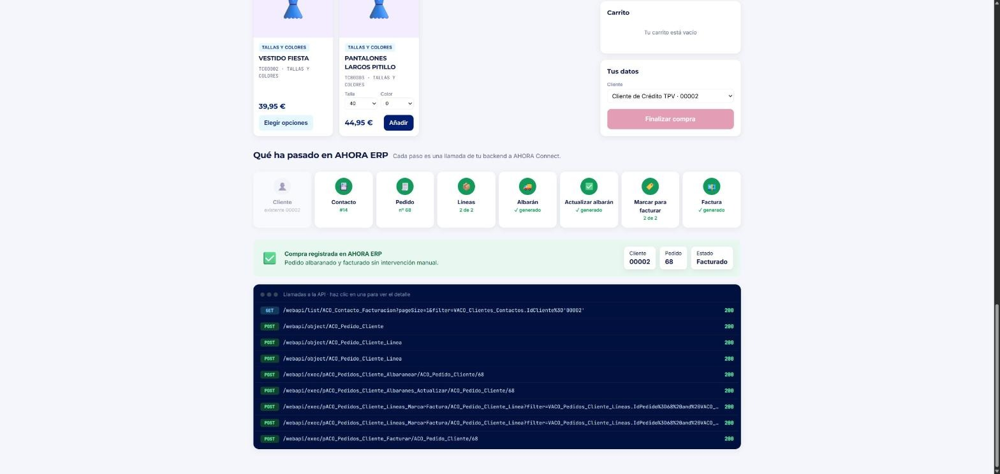
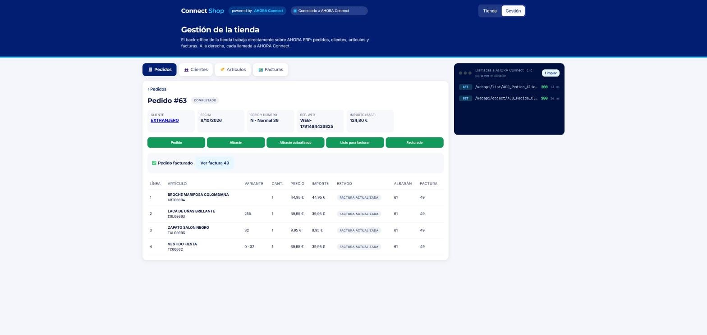
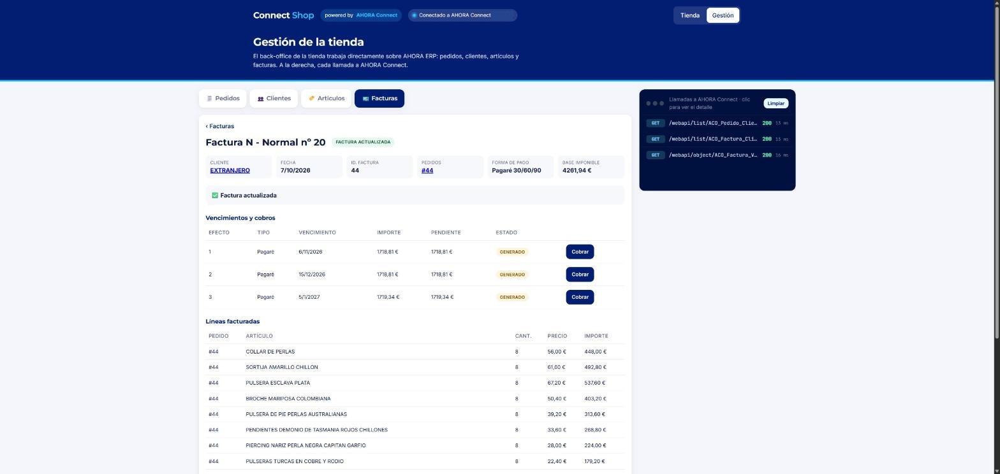
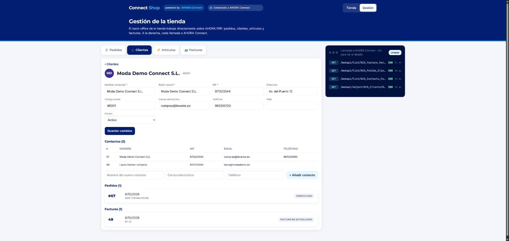
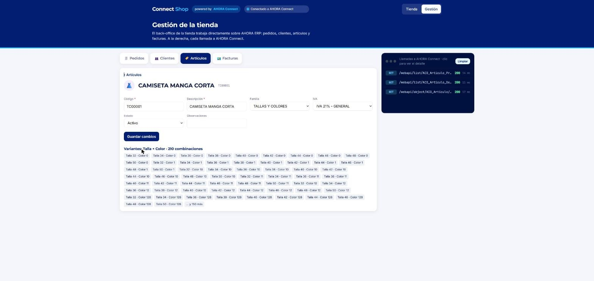

# AHORA Connect Shop · prueba de concepto

**Connect Shop** es una tienda online de ejemplo, con su back-office, integrada con **AHORA ERP** a través de **AHORA Connect**.

> ⚠️ **Esto no es un producto.** Es una **prueba de concepto** con fines didácticos: enseña, con código real y funcionando, cómo una web a medida (una tienda online, un portal...) puede integrarse con **AHORA ERP** a través de **AHORA Connect**, la API REST del ERP.
>
> - No tiene soporte, ni versionado, ni garantías.
> - No está pensada para producción: no hay usuarios, ni login de clientes, ni pasarela de pago, ni gestión de stock, ni tarifas.
> - Los precios de la tienda son inventados (AHORA Connect no expone tarifas) y el diseño es solo ilustrativo.
>
> La idea es **"descárgatelo y mira cómo se hace"**: leer el código, lanzar las llamadas y adaptar lo que te sirva a tu proyecto.

## Qué incluye

| Ruta | Qué es | Para quién |
|------|--------|------------|
| [`AGENTS.md`](AGENTS.md) | **Guía completa para consumir AHORA Connect**: autenticación, endpoints, filtros, campos obligatorios, procesos de negocio, errores y comportamientos no evidentes. Está escrita para que la pueda leer un asistente de IA (Claude, Copilot, Cursor...), pero también sirve como documentación para personas. | Desarrolladores y asistentes de IA |
| [`requests/ahora-connect.http`](requests/ahora-connect.http) | Todas las llamadas del flujo de venta, listas para lanzar una a una desde VS Code (extensión REST Client) o JetBrains | Quien quiera probar la API sin escribir código |
| [`tienda/server.mjs`](tienda/server.mjs) | Backend de una tienda de ejemplo en Node 20+, sin dependencias. **Todo el código de integración con AHORA Connect está aquí.** | Desarrolladores |
| [`tienda/public/index.html`](tienda/public/index.html) | **Tienda**: catálogo, variantes (talla/color), carrito, compra con el flujo del ERP en directo y "Mi cuenta" con las facturas | Demostraciones |
| [`tienda/public/gestion.html`](tienda/public/gestion.html) | **Gestión (back-office)**: pedidos (albaranar, facturar paso a paso o de una vez), clientes y contactos, artículos (alta, edición, familias, IVA, variantes) y facturas (contabilizar, cobrar efectos) | Demostraciones |
| [`tienda/demo-erp.mjs`](tienda/demo-erp.mjs) | Simulador de AHORA Connect para el modo demo. **No forma parte de la integración.** | Ver la demo sin ERP |

## Qué demuestra

Una compra en la tienda recorre el ciclo completo de venta en el ERP. Cada paso es una llamada a AHORA Connect, y la pantalla la muestra en directo:

```
Catálogo ──► Cliente ──► Contacto ──► Pedido ──► Líneas ──► Albarán ──► Actualizar ──► Marcar para ──► Factura
(ERP→web)    (alta o     (consulta     (cabecera)  (con talla/  (proceso)   albarán        facturar        (proceso)
             existente)   o alta)                  color)                   (proceso)      (por línea)
```

- **ERP → web:** catálogo de artículos de venta (por familia), propiedades y combinaciones válidas (talla, color), clientes y facturas.
- **Web → ERP:** alta de cliente y contacto, pedido con sus líneas, y los procesos de negocio que generan albarán y factura.

## En imágenes

Flujo completo contra un AHORA Connect real: compra en la tienda → pedido en la gestión → factura contabilizada.



| Tienda | |
|---|---|
|  |  |
| Catálogo leído del ERP (artículos de venta por familia) | Compra terminada: los 8 pasos en verde y las llamadas a la API |

| Gestión (back-office) | |
|---|---|
|  |  |
| Pedido con sus fases y el estado de cada línea | Factura con sus vencimientos, lista para cobrar |
|  |  |
| Cliente con contactos, pedidos y facturas | Artículo con sus combinaciones de talla y color |

## Cómo ejecutarlo

### Requisitos

- **Node.js 20 o superior** ([nodejs.org](https://nodejs.org)). No hay dependencias que instalar: ni `npm install` ni `node_modules`.
- Para usarlo contra el ERP real: una instalación de **AHORA Connect** accesible desde tu equipo y un **usuario de la WebAPI**. Usa un entorno de pruebas.

### Opción 1 · Modo demo (sin ERP)

```bash
cd tienda
node server.mjs
```

Arranca un AHORA Connect simulado en memoria. Sirve para ver la tienda y el flujo de compra; la **gestión necesita un AHORA Connect real**. Verás una franja amarilla avisando de que es una simulación.

### Opción 2 · Contra tu AHORA Connect

1. Crea tu fichero de configuración a partir de la plantilla:

   ```bash
   cd tienda
   cp .env.example .env          # en Windows: copy .env.example .env
   ```

2. Rellena `.env`. Ver la [tabla de configuración](#configuración-env).
3. Arranca:

   ```bash
   node --watch --env-file=.env server.mjs
   ```

   `--watch` reinicia el servidor solo cuando cambias el código. Es opcional, pero cómodo si vas a tocarlo.

4. Abre en el navegador:
   - **Tienda:** `http://localhost:3000`
   - **Gestión (back-office):** `http://localhost:3000/gestion`

> Contra un AHORA Connect real, **todo lo que hagas crea o modifica registros de verdad**: clientes, pedidos, albaranes, facturas, cobros…

> El servidor **solo escucha en `localhost`**. La gestión permite escribir en el ERP y no tiene usuarios propios, así que no lo expongas en red.

### Configuración (`.env`)

| Variable | Obligatoria | Qué es | Cómo obtener el valor |
|----------|-------------|--------|-----------------------|
| `CONNECT_URL` | Sí (sin ella: modo demo) | URL base de AHORA Connect, **sin** `/webapi` | P. ej. `http://servidor/AhoraConnect`. Compruébala abriendo `CONNECT_URL/webapi` en el navegador: debe devolver el Swagger en JSON |
| `CONNECT_USER` | Sí | Usuario de la WebAPI | Lo da de alta el administrador de AHORA Connect |
| `CONNECT_PASSWORD` | Sí | Contraseña de ese usuario | — |
| `ID_EMPRESA` | Sí | Empresa en la que se crean clientes y pedidos | `GET /webapi/list/ACO_Empresa` → `IdEmpresa` |
| `SERIE_PEDIDO` | Sí | Serie de los pedidos de venta | `GET /webapi/list/ACO_Serie` → `SerieFactura` |
| `ID_MONEDA` | Sí | Moneda de los pedidos | `GET /webapi/list/ACO_Moneda` → `IdMoneda` (normalmente euros) |
| `ID_ALMACEN` | Sí | Almacén de las líneas de pedido | `GET /webapi/list/ACO_Almacen` → `IdAlmacen` |
| `ID_IVA` | Sí | IVA de las líneas y de los clientes nuevos | `GET /webapi/list/ACO_IVA` → `IdIVA` |
| `ID_IMPUESTO` | Sí | Impuesto indirecto de los clientes nuevos (IVA, IGIC…) | `GET /webapi/list/ACO_Impuesto` → `IdImpuesto` |
| `FORMA_PAGO` | No | Forma de pago de los pedidos de la tienda | Código de forma de pago del ERP. **Sin ella, el pedido va al contado y su factura no genera vencimientos para cobrar.** Puedes ver los códigos en `FormaPago` / `FormaPago_flxtext` de pedidos existentes (`GET /webapi/list/ACO_Pedido_Cliente`) |
| `PORT` | No | Puerto local | Por defecto `3000` |

Las consultas `GET /webapi/list/...` necesitan token. La forma más rápida de lanzarlas es con [`requests/ahora-connect.http`](requests/ahora-connect.http): primero el login y luego cualquier listado.

El `.env` contiene credenciales: **no lo subas al repositorio**. Ya está en `.gitignore`.

### Problemas habituales

| Síntoma | Causa probable |
|---------|----------------|
| `Login AHORA Connect: HTTP 400/401` | Usuario o contraseña incorrectos, o el usuario no tiene acceso a la WebAPI |
| El catálogo sale vacío | Ningún artículo cumple el filtro de venta: activo, con familia distinta de `0` y sin lotes ni series |
| `missing required fields: …` | La configuración de tu instalación exige campos que el ejemplo no envía: consulta `GET /webapi/schema/{objeto}` (ver `AGENTS.md`) |
| `No credentials to run … process` | Casi siempre, el registro no está en el estado que necesita ese proceso. Ver `AGENTS.md` |
| La factura no tiene vencimientos | El pedido se hizo al contado: configura `FORMA_PAGO` |

## AHORA Connect en 2 minutos

Todos los detalles están en [`AGENTS.md`](AGENTS.md). Lo esencial:

| Concepto | Cómo funciona |
|----------|---------------|
| Autenticación | OAuth2 *password grant*: `POST /token` → `access_token`, que va en `Authorization: Bearer …` |
| Especificación | `GET /webapi` devuelve el Swagger completo de la instalación, sin token |
| Leer | `GET /webapi/list/{objeto}?filter=…` y `GET /webapi/object/{objeto}/{id}` |
| Escribir | `POST` / `PUT` / `DELETE /webapi/object/{objeto}` |
| Procesos de negocio | `POST /webapi/exec/{proceso}/{objeto}/{id}` (albaranear, facturar, cobrar…) |
| Campos obligatorios | `GET /webapi/schema/{objeto}`: `IsRequired` y `DefaultValue`. Varían entre instalaciones |
| Errores de negocio | HTTP 500 con el mensaje de validación del ERP |

**Lo que no es evidente y conviene saber antes de empezar** (todo explicado en `AGENTS.md`):

- Envía siempre `Accept: application/json`: con XML la API falla al serializar los valores NULL.
- `filter` es una cláusula WHERE de SQL. Cualifica cada columna con la vista del objeto (`VACO_Articulos.Estado=0`), porque si no puede ser ambigua.
- Los campos obligatorios los define la configuración de cada instalación: valídalos con `/schema`.
- Para facturar un pedido, las líneas tienen que pasar por los estados correctos: albarán → actualizar → marcar para facturar → facturar.
- El mensaje *"No credentials to run … process"* casi nunca es un problema de permisos: suele significar que el registro no está en el estado que ese proceso necesita.
- AHORA Connect no envía webhooks: para enterarte de los cambios en el ERP hay que consultarlo periódicamente.

## Arquitectura recomendada

```
Navegador ──► Tu backend (credenciales, reglas, reintentos) ──► AHORA Connect ──► AHORA ERP
```

- **El navegador nunca llama directamente a AHORA Connect.** Las credenciales de la API viven en tu backend.
- Guarda tu nº de pedido web en `IdPedidoCli` para cruzar pedidos y detectar duplicados al reintentar.
- No hay transacciones entre llamadas: diseña cada paso para que se pueda reintentar por separado.
- **ERP → web:** consulta periódica (*polling*) filtrando por fecha o por estado.

## Vídeos

| # | Tema | Vídeo |
|---|------|-------|
| 1 | Qué es AHORA Connect | _pendiente_ |
| 2 | Autenticación y primera llamada | _pendiente_ |
| 3 | Del pedido web a la factura en el ERP | [GIF del flujo completo](docs/connect-shop-flujo-completo.gif) |
